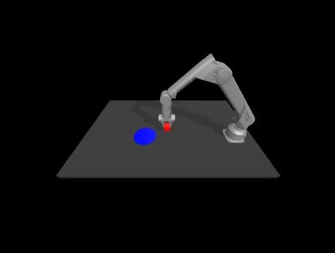

## ACT with GalaXea Robotic Arm A1 🦾

### After completing this project, you will:

- [ ] Understand how to configure the ACT conda environment
- [ ] Understand how to use MuJoCo to generate simulated training data
- [ ] Understand how to train and infer using ACT
- [ ] Understand how ACT hyperparameters affect training results

### Your Task:

Use ACT to train the GalaXea A1 robotic arm in the MuJoCo simulation environment so that it can pick up a red cube and successfully place it on a blue disc.



Reward distribution:

- Gripper touches the cube: reward = 1
- Successfully picks up the cube: reward = 2
- Successfully places the cube on the blue disc: reward = 3

Can you make the robotic arm always score the maximum 3 points?

### Detailed Steps:

1. Configure the conda environment required for ACT:
    1. Download Anaconda: [https://www.anaconda.com/download/success](https://www.anaconda.com/download/success)
    2. Run the following commands in the Terminal to create an environment named `act_a1` and install the necessary dependencies:
    
    ```bash
    conda create -n act_a1 python=3.8.10
    conda activate act_a1
    pip install torchvision
    pip install torch
    pip install pyquaternion
    pip install pyyaml
    pip install rospkg
    pip install pexpect
    pip install mujoco==2.3.7
    pip install dm_control==1.0.14
    pip install opencv-python
    pip install matplotlib
    pip install einops
    pip install packaging
    pip install h5py
    pip install ipython
    cd act/detr && pip install -e .
    ```
    
2. Use the script to generate training data:
    
    Open the Terminal and run the following command in the `act_galaxea_a1` directory:
    
    ```bash
    python3 record_sim_episodes_a1.py \
    --task_name sim_pick_n_place_cube_scripted \
    --dataset_dir data/sim_pick_n_place_cube_scripted \
    --num_episodes 50
    
    # If you want to watch real-time rendering, add the following flag:
    --onscreen_render
    ```
    
3. View the generated training data:
    
    ```bash
    python3 visualize_episodes.py \
    --dataset_dir data/sim_pick_n_place_cube_scripted \
    --episode_idx 0 # Choose the episode index you want to watch
    ```
    
4. Training:
    
    ```bash
    python3 imitate_episodes.py \
    --task_name sim_pick_n_place_cube_scripted \
    --ckpt_dir ckpt_dir --policy_class ACT \
    --kl_weight 10 --chunk_size 100 \
    --hidden_dim 512 --batch_size 8 \
    --dim_feedforward 3200 --num_epochs 500 \
    --lr 1e-5 --seed 0 --temporal_agg
    ```
    
5. Evaluate the training results:
    
    ```bash
    python3 imitate_episodes.py \
    --task_name sim_pick_n_place_cube_scripted \
    --ckpt_dir ckpt_dir --policy_class ACT \
    --kl_weight 10 --chunk_size 100 \
    --hidden_dim 512 --batch_size 8 \
    --dim_feedforward 3200 --num_epochs 500 \
    --lr 1e-5 --seed 0 --temporal_agg --eval
    ```
    
6. If you follow the given hyperparameters for training, you will find that the probability of achieving the maximum score of 3 points is below 20%. You will need to tune the parameters to improve the success rate. Share your success rate in the comments section!
7. Bonus: Observe the training data videos you generated. Did you come up with any unusual methods to improve the success rate?
